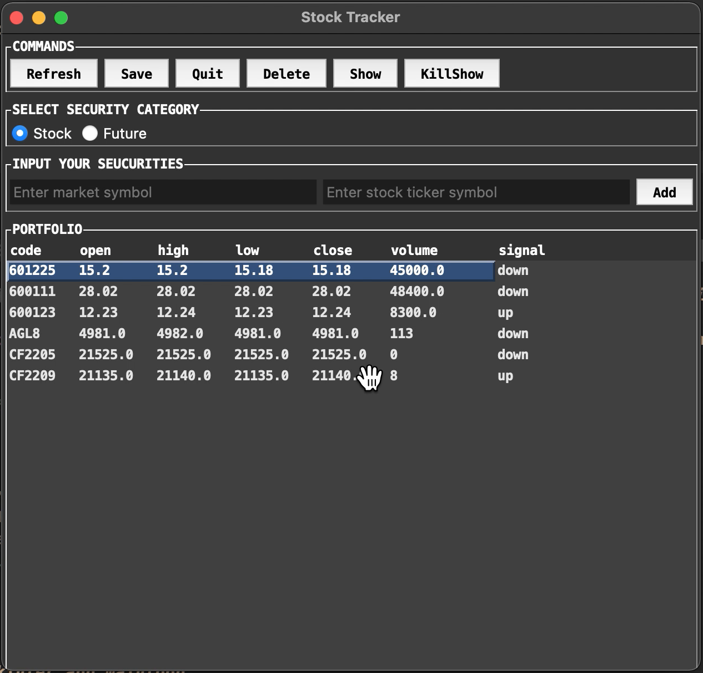

### Stock-Tracker-v2
A live stock tracker for `live price` + `OHLCV chart` + `live trading signals` monitoring / prompting.  
The demo is based on tkinter with requirements as in ./requirements.txt.  
Thanks to ref: [briantam/Stock-Tracker](https://github.com/briantam/Stock-Tracker), for simply borrow the main frame of it.  
Thanks to ref: [react-stock-chart](https://github.com/rrag/react-stockcharts), for simply borrow the main frame of it.  

### Overview

### Live

### Usage
##### Environment
- Use `virtualenv` for projection environment isolation:
    - 1. `python3 -m venv myvenv` create virtual env in 'myvenv'.
    - 2. `source myvenv/bin/activate` activate venv shell.
    - 3. `pip3 install -r /path/to/requirements.txt` to install all depedencies in myvenv.
    - 4. `deactivate` to exit myvenv.
- Try `pip3 freeze > requirements.txt` to get the requirements list needed in this project.

##### Main
- Use `python3 main.py` to Start the tkinter app mainloop.

### Structure
- `config` include some config files for tkinter portfolio listbox widgets, for live-OHLCV chart parameters etc.
- `live` include core code of live OHLCV react client, and a python3 data request & send websocket server.
- `shell` include some scripts which invokes the web server/client in `live`.
- `main.py` is the main entry of the entire project.
- `app` include core code of tkinter GUI widgets, and main logic of its GUI programming.
- `stock` define a STOCK object used in tkinter GUI widget management. 
- `query` & `query_config` include snippets for live stock prices data requesting api.
- `signals` & `signalgen` include snipptes for generating 'trading-target' signals using live stock prices data & indicators.

